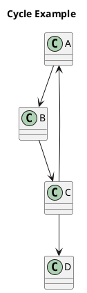
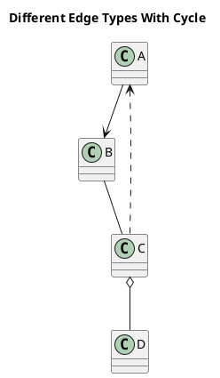

# Shrinking Diagrams

This repository provides a minimal full-stack template with a FastAPI backend and a React + Vite frontend.

## Running the stack with Docker

The easiest way to get both services running together is via Docker Compose. Make sure you have the following prerequisites installed:

- [Docker Engine](https://docs.docker.com/engine/install/)
- [Docker Compose](https://docs.docker.com/compose/install/) (v2 or newer, or Docker Desktop which bundles Compose)

Once Docker is available:

1. Clone this repository and change into its directory.
2. Build and start the containers:

   ```bash
   docker compose up --build
   ```

3. After the build completes, the services are available at:
   - Frontend: <http://localhost:5173>
   - Backend: <http://localhost:8000>

During development you can leave the stack running. Docker Compose will watch for file changes through the mounted volumes and reload the services automatically.

To stop the containers press `Ctrl+C`, or run `docker compose down` in a separate terminal. Use `docker compose down --volumes` if you also want to remove any named volumes created for the stack.

### Useful Docker commands

- Rebuild a single service (e.g. backend) when dependencies change:

  ```bash
  docker compose build backend
  ```

- View container logs:

  ```bash
  docker compose logs -f
  ```

- Run commands inside a service container (e.g. run tests in the backend):

  ```bash
  docker compose exec backend pytest
  ```

Refer to the READMEs inside the `frontend/` and `backend/` directories for instructions on running each service without Docker.

### Environment variables

In order to utilize OpenAI API, you need to copy `.env.example` to `.env` and set the `OPENAI_API_KEY` variable in /backend directory.

### Some testing PUML diagrams

```plantuml
@startuml
title Simple Banking System

class User {
  +name: String
  +email: String
  +login()
}

class Account {
  +accountNumber: String
  +balance: Float
  +deposit(amount: Float)
  +withdraw(amount: Float)
}

class Transaction {
  +id: String
  +amount: Float
  +date: Date
  +process()
}

User "1" --> "1..*" Account
Account "1" --> "0..*" Transaction
Transaction --> User ' this should get removed

@enduml
```





